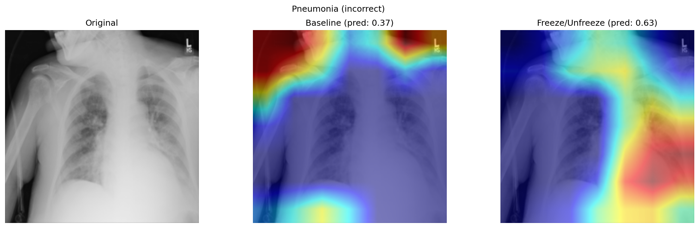

# Chest X-ray Multi-Label Disease Classification

Multi-label classification of 14 thoracic diseases from chest X-rays using ResNet-50, 
achieving 0.76 macro AUC-ROC on NIH ChestX-ray14.




## Key Findings

- Freeze/unfreeze transfer learning improved macro AUC from 0.75 to 0.77
- Grad-CAM analysis revealed the model correctly localizes cardiac pathology 
  but struggles with diffuse conditions like Pneumonia — attending to 
  shoulder regions rather than lung fields
- Pneumonia (0.67) and Infiltration (0.68) remain the hardest classes, 
  consistent with their visual similarity and diffuse presentation

## Results

| Class | Baseline | Freeze/Unfreeze |
|-------|----------|-----------------|
| Atelectasis | 0.7288 | 0.7686 |
| Cardiomegaly | 0.8312 | 0.8622 |
| Effusion | 0.7775 | 0.7935 |
| Infiltration | 0.6758 | 0.6845 |
| Mass | 0.7013 | 0.7451 |
| Nodule | 0.6824 | 0.6932 |
| Pneumonia | 0.6607 | 0.6705 |
| Pneumothorax | 0.8075 | 0.8179 |
| Consolidation | 0.7035 | 0.7145 |
| Edema | 0.8166 | 0.8278 |
| Emphysema | 0.7864 | 0.8080 |
| Fibrosis | 0.7674 | 0.7815 |
| Pleural_Thickening | 0.7235 | 0.7323 |
| Hernia | 0.9023 | 0.8949 |
| **Macro AUC** | **0.7546** | **0.7686** |

## Approach

- **Dataset**: NIH ChestX-ray14 (~112k images, 14 disease labels)
- **Architecture**: ResNet-50 pretrained on ImageNet
- **Loss**: BCEWithLogitsLoss with class-frequency pos_weight to handle imbalance
- **Training strategy**: 
  - Phase 1: Freeze backbone, train FC layer (5 epochs, lr=1e-3)
  - Phase 2: Unfreeze all layers, fine-tune (10 epochs, lr=1e-5)
- **Evaluation**: Per-class and macro-averaged AUC-ROC

## Interpretability

Grad-CAM visualizations on the final convolutional layer comparing 
baseline vs freeze/unfreeze models across strong and weak performing classes.

Strong Performing Classes:

_35.png)

_0.png)

Weak Performing Classes:


_31.png)


## Project Structure

```
├── src/
│   ├── dataset.py          # PyTorch Dataset class for ChestX-ray14
│   ├── model.py            # ResNet-50 model with freeze/unfreeze support
│   ├── train.py             # Baseline training script
│   ├── train_freeze.py      # Freeze/unfreeze training script
│   ├── evaluate.py          # Test set evaluation with per-class AUC
│   ├── utils.py             # Transforms and helper functions
│   └── download_data.py     # Dataset download script
├── notebooks/
│   ├── exploratory-data-analysis.ipynb
│   └── grad-cam-analysis.ipynb
├── outputs/                 # Grad-CAM visualizations and results
├── models/                  # Saved model checkpoints (not tracked)
├── data/                    # Dataset cache (not tracked)
├── requirements.txt
└── README.md
```

## Setup & Reproduce

```bash
# Clone the repo
git clone https://github.com/TrinhVox/medical-image-classification.git
cd medical-image-classification

# Create virtual environment
python3 -m venv .venv
source .venv/bin/activate

# Install dependencies (GPU)
pip install torch torchvision --index-url https://download.pytorch.org/whl/cu126
pip install -r requirements.txt

# Download dataset (5k sample for dev, --full for entire dataset)
cd src
python download_data.py
python download_data.py --full  # ~45GB

# Train baseline
python train.py

# Train freeze/unfreeze
python train_freeze.py

# Evaluate on test set
python evaluate.py --model best_model_params.pt
python evaluate.py --model best_model_params_freeze.pt
```

## Future Work

- DenseNet-121 backbone (used in CheXNet)
- Focal loss for hard-to-classify diseases
- Higher input resolution for small findings (Nodule)
- Attention mechanisms to improve Pneumonia localization

## References

- [Original NIH paper](https://arxiv.org/abs/1705.02315)
- [CheXNet (Rajpurkar et al.)](https://arxiv.org/abs/1711.05225)